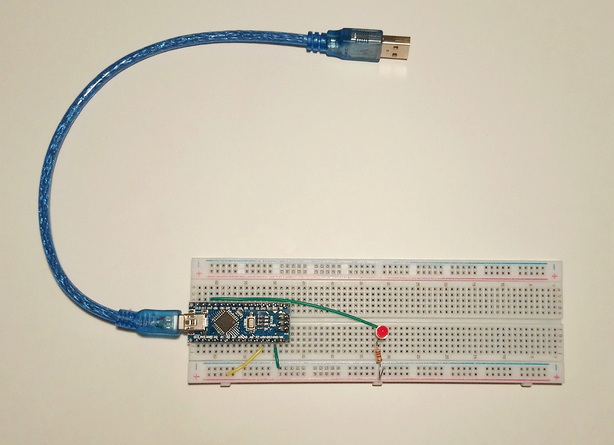
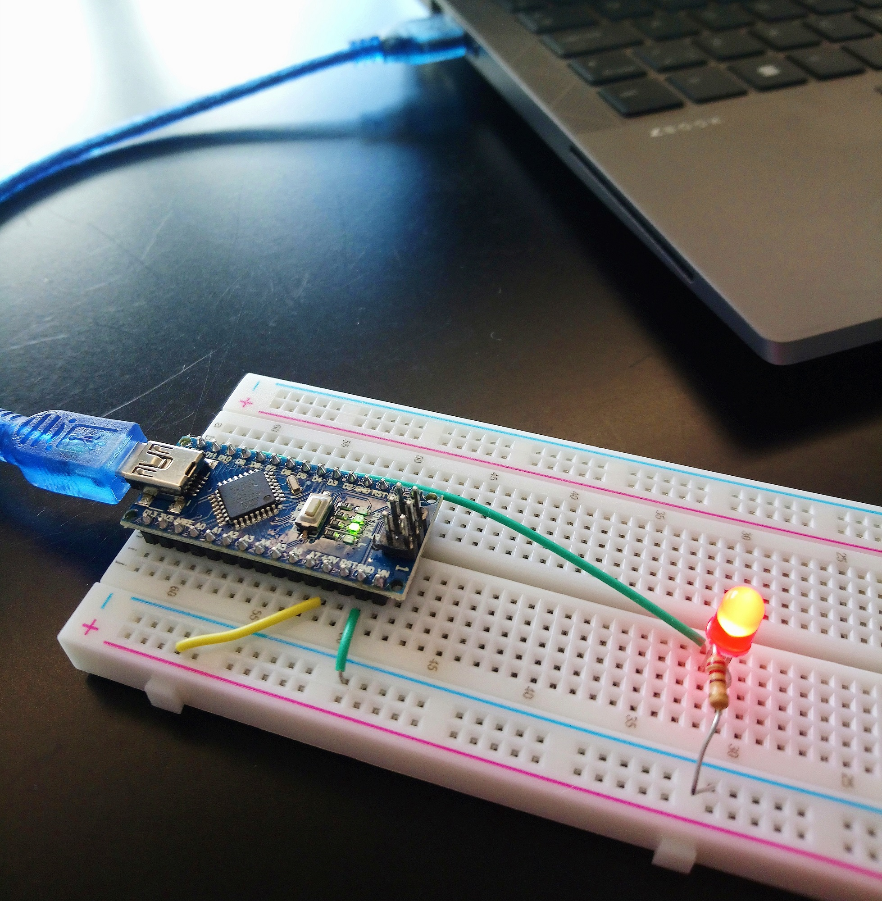
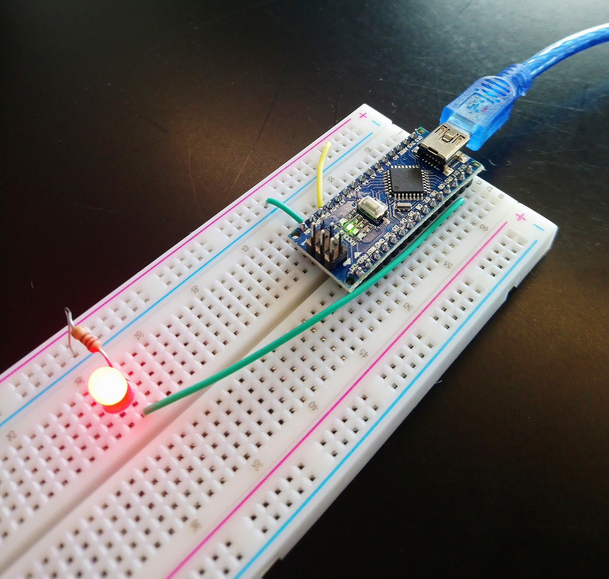

# Morse code with blinking LED

A variation of the [blinking LED exercise](https://docs.arduino.cc/built-in-examples/basics/Blink) using Arduino Nano and an on-board LED.

The serial monitor asks the user for a message. The message can contain letters from A to Z and numbers from 0 to 9. If the message contains other characters, the monitor responds and asks for a new message.

The LED blinks the message in [Morse code](https://en.wikipedia.org/wiki/Morse_code) while the serial monitor prints out the Morse code in dots and dashes. When it's done, the programme loops back and asks the user for a new message.

## How to run the programme

Open the *morse-code.ino* file in Arduino IDE, connect the Arduino Nano board with the set-up shown below, and click "upload".

    
    
    

